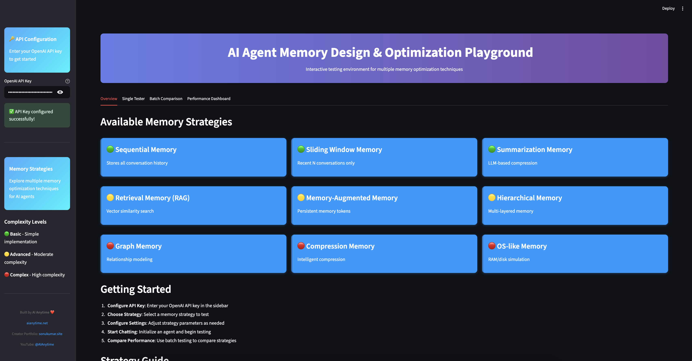

# AI Agent Memory Design & Optimization Playground

[](https://python.org)
[](https://streamlit.io)
[](https://fastapi.tiangolo.com)
[](LICENSE)

> **Interactive playground for testing and comparing 9 different AI agent memory optimization strategies**



## Overview

This project implements **9 different memory optimization techniques** for AI agents, providing a comprehensive solution for managing conversation history and context in production AI systems. Each strategy is implemented as a modular, plug-and-play class with a unified interface.

### Why Memory Optimization Matters

- **Token Cost Reduction**: Prevent exponential growth in LLM API costs
- **Context Preservation**: Maintain relevant information across conversations
- **Scalability**: Handle long conversations efficiently
- **Performance**: Optimize response times and memory usage

## Memory Strategies Implemented

### Basic Strategies
1. **Sequential Memory** - Complete conversation history storage
2. **Sliding Window Memory** - Fixed-size recent conversation window
3. **Summarization Memory** - LLM-based conversation compression

### Advanced Strategies
4. **Retrieval Memory (RAG)** - Vector similarity search for semantic retrieval
5. **Memory-Augmented Memory** - Persistent memory tokens with sliding window
6. **Hierarchical Memory** - Multi-layered working + long-term memory

### Complex Strategies
7. **Graph Memory** - Knowledge graph with entity relationships
8. **Compression Memory** - Intelligent compression with importance scoring
9. **OS-like Memory** - RAM/disk simulation with paging mechanisms

## Features

- **Modular Architecture** - Strategy pattern for easy swapping
- **Interactive Playground** - Streamlit web interface for testing
- **Performance Analytics** - Token usage and response time tracking
- **Batch Comparison** - Test multiple strategies simultaneously
- **Production Ready** - FastAPI endpoints for deployment
- **Real-time Metrics** - Memory statistics and performance monitoring

## Installation

### Prerequisites
- Python 3.10+
- OpenAI API Key

### Setup

1. **Clone the repository**
```bash
git clone https://github.com/AIAnytime/Agent-Memory-Playground.git
cd Agent-Memory-Playground
```

2. **Install dependencies**
```bash
pip install -r requirements.txt
```

3. **Configure environment**
```bash
# Create .env file
echo "OPENAI_API_KEY=your_openai_api_key_here" > .env
```

## Quick Start

### 1. Interactive Playground (Streamlit)
```bash
streamlit run streamlit_playground.py
```
- Open http://localhost:8501 in your browser
- Enter your OpenAI API key in the sidebar
- Select a memory strategy and start testing!

### 2. API Server (FastAPI)
```bash
uvicorn api:app --reload
```
- API documentation: http://localhost:8000/docs
- Create sessions, chat, and monitor performance via REST API

### 3. Command Line Example
```bash
python example_usage.py
```
- Interactive CLI for testing all memory strategies
- Detailed memory statistics and performance metrics

## Usage Examples

### Basic Usage
```python
from memory_strategies import SequentialMemory, AIAgent

# Initialize memory strategy
memory = SequentialMemory()
agent = AIAgent(memory_strategy=memory)

# Chat with the agent
response = agent.chat("Hello! My name is Alex.")
print(response["ai_response"])

# Memory automatically preserved for next interaction
response = agent.chat("What's my name?")
print(response["ai_response"])  # Will remember "Alex"
```

### Advanced RAG Implementation
```python
from memory_strategies import RetrievalMemory, AIAgent

# Initialize RAG-based memory
memory = RetrievalMemory(k=3)  # Retrieve top 3 similar conversations
agent = AIAgent(memory_strategy=memory)

# Build conversation history
agent.chat("I'm a software engineer working on ML projects")
agent.chat("I prefer Python and love coffee")
agent.chat("I'm building a recommendation system")

# Query with semantic similarity
response = agent.chat("What do you know about my work?")
# Will retrieve relevant context about ML, Python, and recommendation systems
```

### Production API Usage
```bash
# Create a session with hierarchical memory
curl -X POST "http://localhost:8000/sessions" \
  -H "Content-Type: application/json" \
  -d '{
    "strategy_type": "hierarchical",
    "system_prompt": "You are a helpful AI assistant.",
    "api_key": "your_openai_key"
  }'

# Chat with the session
curl -X POST "http://localhost:8000/sessions/{session_id}/chat" \
  -H "Content-Type: application/json" \
  -d '{
    "message": "Remember that I prefer concise responses",
    "api_key": "your_openai_key"
  }'
```

## Performance Comparison

| Strategy | Token Efficiency | Retrieval Speed | Memory Usage | Best For |
|----------|------------------|-----------------|--------------|----------|
| Sequential | ❌ Low | ⚡ Instant | 📈 High | Short conversations |
| Sliding Window | ✅ High | ⚡ Instant | 📊 Constant | Real-time chat |
| Retrieval (RAG) | ✅ High | 🔍 Fast | 📊 Medium | Production systems |
| Hierarchical | ✅ Very High | 🔍 Fast | 📊 Medium | Complex applications |
| Graph Memory | 🔍 Medium | 🐌 Slow | 📈 High | Knowledge systems |

## Architecture

### Strategy Pattern Design
```
AIAgent
├── BaseMemoryStrategy (Abstract)
│   ├── add_message()
│   ├── get_context()
│   └── clear()
├── SequentialMemory
├── SlidingWindowMemory
├── RetrievalMemory
└── ... (6 more strategies)
```

### Key Components
- **Memory Strategies**: Modular memory implementations
- **AI Agent**: Core agent using strategy pattern
- **Utilities**: Token counting, embeddings, LLM integration
- **API Layer**: FastAPI endpoints for production use
- **Playground**: Streamlit interface for testing

## Monitoring & Metrics

Track essential performance metrics:

```python
{
    "total_content_tokens": 1250,      # Raw conversation data
    "total_prompt_tokens": 4800,       # Actual LLM costs
    "average_retrieval_time": 0.15,    # Memory access speed
    "memory_efficiency": 0.73,         # Compression ratio
    "context_relevance_score": 0.89    # Quality of retrieved context
}
```

## Configuration

### Memory Strategy Parameters

**Sliding Window Memory**
```python
SlidingWindowMemory(window_size=4)  # Keep last 4 conversation turns
```

**Retrieval Memory (RAG)**
```python
RetrievalMemory(k=3)  # Retrieve top 3 similar conversations
```

**Hierarchical Memory**
```python
HierarchicalMemory(
    window_size=2,  # Working memory size
    k=3            # Long-term retrieval count
)
```

## Production Deployment

### Docker Deployment
```dockerfile
FROM python:3.9-slim

WORKDIR /app
COPY requirements.txt .
RUN pip install -r requirements.txt

COPY . .
EXPOSE 8000

CMD ["uvicorn", "api:app", "--host", "0.0.0.0", "--port", "8000"]
```

### Environment Variables
```bash
OPENAI_API_KEY=your_openai_api_key
OPENAI_MODEL=gpt-4o-mini
EMBEDDING_MODEL=text-embedding-3-small
```

## Testing

Run the test suite:
```bash
python -m pytest tests/
```

Run performance benchmarks:
```bash
python benchmark.py
```

## Documentation

- **[Technical Guide](AI_Agent_Memory_Documentation.md)** - Comprehensive implementation details
- **[API Documentation](http://localhost:8000/docs)** - FastAPI interactive docs
- **[Strategy Comparison](docs/strategy-comparison.md)** - Performance analysis
- **[Production Guide](docs/production-guide.md)** - Deployment best practices

## Contributing

We welcome contributions! Please see our [Contributing Guidelines](CONTRIBUTING.md) for details.

1. Fork the repository
2. Create a feature branch (`git checkout -b feature/amazing-feature`)
3. Commit your changes (`git commit -m 'Add amazing feature'`)
4. Push to the branch (`git push origin feature/amazing-feature`)
5. Open a Pull Request

## License

This project is licensed under the Apache 2.0 License - see the [LICENSE](LICENSE) file for details.

## Acknowledgments

- **OpenAI** for providing the GPT models and embeddings
- **Streamlit** for the amazing web framework
- **FastAPI** for the high-performance API framework
- **FAISS** for efficient vector similarity search

## Support & Contact

- **Website**: [aianytime.net](https://aianytime.net)
- **Creator Portfolio**: [sonukumar.site](https://sonukumar.site)
- **YouTube**: [@AIAnytime](https://www.youtube.com/@AIAnytime)
- **Issues**: [GitHub Issues](https://github.com/AIAnytime/Agent-Memory-Playground/issues)

---

<div align="center">
  <p>Built with ❤️ by <strong>AI Anytime</strong></p>
  <p>Star this repo if you find it helpful!</p>
</div>
